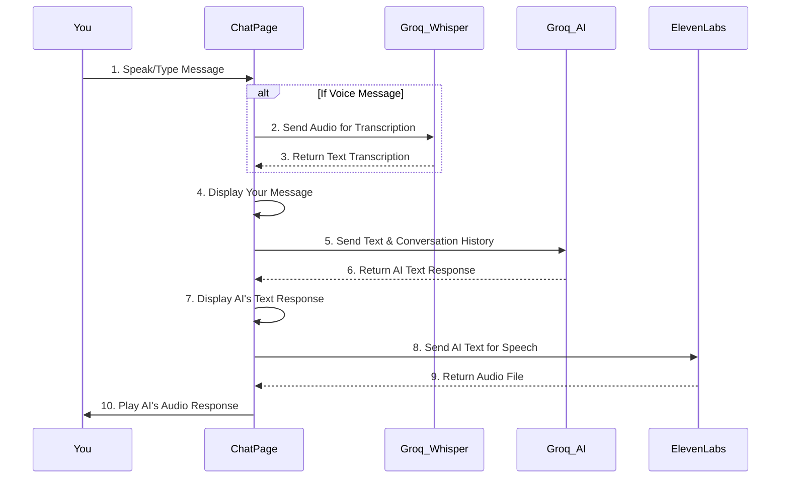

# Chapter 1: AI Chat Interaction & Processing

Welcome to the first chapter of the CerdasBudi tutorial! In this chapter, we're going to dive into the very heart of our chatbot application: how you talk to the AI, and how the AI talks back to you. Think of it as the brain and mouth of CerdasBudi.

### What is AI Chat Interaction & Processing?

Imagine you're having a conversation with a really smart friend who can listen to what you say, understand it, think deeply about it, and then respond to you, either by typing or speaking. That's exactly what "AI Chat Interaction & Processing" is all about in CerdasBudi.

**The main problem it solves:** How do we enable a natural, human-like conversation with an artificial intelligence inside our app?

**Our Goal for this Chapter:** By the end of this chapter, you'll understand the magic behind how CerdasBudi takes your words, gets a smart reply from an AI, and even speaks it back to you.

### The Conversation Flow: Your Words to AI's Reply

Let's break down how a typical conversation with CerdasBudi works. It has three main steps:

1.  **Taking Your Input**: You can either type your message into a text box or speak it using your microphone.
2.  **AI's Brain Power (Groq)**: Your message (whether typed or spoken) is sent to a super-fast AI brain provided by **Groq**. This AI brain processes your message, understands your feelings, and comes up with a thoughtful response.
3.  **AI's Voice (ElevenLabs)**: Once Groq gives us the text response, CerdasBudi can convert that text into a natural-sounding voice using another service called **ElevenLabs**. This makes the conversation feel even more alive!

It's like having a thoughtful friend who is also an excellent translator between your thoughts and the AI's understanding.

### How You Talk to CerdasBudi (Using `ChatPage`)

All the core chat interaction happens within the `ChatPage.tsx` file. Let's look at how your input is handled.

#### 1. Sending a Text Message

When you type a message and press "Send" (or Enter), the application calls a function to handle your input.

Here’s a simplified look at how your text message is sent:

```typescript
// src/components/ChatPage.tsx (simplified)

const sendTextMessage = async () => {
  const content = inputMessage.trim();
  if (!content) return; // Don't send empty messages

  // 1. Add your message to the chat display
  const userMessage = { id: 'user_123', content, type: 'user', timestamp: new Date() };
  onMessagesUpdate([...messages, userMessage]); // Update display

  // 2. Ask the AI for a response
  const botResponse = await processWithCerdasBudi(content, [...messages, userMessage]);

  // 3. Add AI's response to the chat display
  const botMessage = { id: 'bot_456', content: botResponse, type: 'bot', timestamp: new Date() };
  onMessagesUpdate([...messages, botMessage]);
};
```

**Explanation:**
This code first takes what you typed, adds it to the list of messages shown on the screen, and then sends it to the AI for a reply. Once the AI replies, that message is also added to your chat.

#### 2. Sending a Voice Message

CerdasBudi can also listen to your voice! When you record a message, two things happen:

*   **Transcription (Whisper)**: Your recorded voice is first sent to **Groq's Whisper model** which converts your spoken words into text. This is like having a super accurate speech-to-text transcriber.
*   **AI Processing**: Once your voice is turned into text, it follows the same path as a typed message – it's sent to the AI brain (Groq) to get a response.

Here's a simplified overview:

```typescript
// src/components/ChatPage.tsx (simplified)

const sendVoiceMessage = async () => {
  if (!recordedAudio) return; // Make sure we have a recording

  // 1. Convert voice to text (using Groq's Whisper API)
  const formData = new FormData();
  formData.append('file', new File([recordedAudio.blob], 'recording.webm'));
  const transcriptionResponse = await fetch('https://api.groq.com/openai/v1/audio/transcriptions', { /* ... */ });
  const transcriptionData = await transcriptionResponse.json();
  const userText = transcriptionData.text; // Your words as text!

  // 2. Add your transcribed message to the chat display
  const userMessage = { id: 'voice_123', content: userText, type: 'user', timestamp: new Date() };
  onMessagesUpdate([...messages, userMessage]);

  // 3. Ask the AI for a response (same as text message)
  const botResponse = await processWithCerdasBudi(userText, [...messages, userMessage]);

  // 4. Add AI's response to the chat display
  const botMessage = { id: 'bot_789', content: botResponse, type: 'bot', timestamp: new Date() };
  onMessagesUpdate([...messages, botMessage]);
};
```

**Explanation:**
This process handles your spoken input. First, it uses the Whisper AI to write down what you said. Then, just like with typed messages, it sends this text to the AI to get a reply, and finally shows both your transcription and the AI's response in the chat.

### The AI's Brain: Processing with Groq

The core intelligence of CerdasBudi comes from a powerful AI model provided by **Groq**. When your message (text or transcribed voice) reaches the AI, it uses a special "system prompt" to guide its behavior. This system prompt tells the AI: "You are CerdasBudi, an AI psychologist focused on supporting bullying victims." It also provides your basic profile (name, age, gender) to make the conversation more personalized.

Here's a simplified version of the function that talks to the Groq AI:

```typescript
// src/components/ChatPage.tsx (simplified)

const processWithCerdasBudi = async (message: string, currentMessages: Message[]): Promise<string> => {
  // We send the entire conversation history to the AI for context
  const conversationHistory = currentMessages.map(msg => ({
    role: msg.type === 'user' ? 'user' : 'assistant',
    content: msg.content
  }));

  const response = await fetch('https://api.groq.com/openai/v1/chat/completions', {
    method: 'POST',
    headers: { 'Authorization': `Bearer ${userData.apiKey}` }, // Your secret key!
    body: JSON.stringify({
      model: "llama-3.3-70b-versatile", // The specific AI model we're using
      messages: [
        { role: "system", content: `Kamu adalah CerdasBudi, AI psikolog...` }, // AI's instructions
        ...conversationHistory // Your conversation so far
      ],
    })
  });

  const data = await response.json();
  return data.choices[0].message.content; // The AI's reply!
};
```

**Explanation:**
This function is like sending a letter to the AI's brain. It includes all your previous messages so the AI remembers the conversation. The AI then reads your message and its instructions, thinks, and sends back a reply.

### The AI's Voice: Speaking with ElevenLabs

After Groq sends back a text response, CerdasBudi can turn that text into spoken words using **ElevenLabs**. This makes the chatbot more accessible and user-friendly, allowing you to listen to CerdasBudi's advice.

Here's how we get CerdasBudi to speak:

```typescript
// src/components/ChatPage.tsx (simplified)

const playTTS = async (text: string, messageId: string) => {
  try {
    const response = await fetch("https://api.elevenlabs.io/v1/text-to-speech/...", {
      method: "POST",
      headers: { "xi-api-key": import.meta.env.VITE_ELEVENLABS_API_KEY }, // ElevenLabs key
      body: JSON.stringify({ text: text, model_id: "eleven_multilingual_v2" })
    });

    if (!response.ok) throw new Error('TTS generation failed');

    const audioBlob = await response.blob(); // Get the audio data
    const audioUrl = URL.createObjectURL(audioBlob); // Create a temporary link
    
    const audio = new Audio(audioUrl); // Create an audio player
    audio.play(); // Make it speak!
  } catch (error) {
    console.error('Error generating TTS:', error);
  }
};
```

**Explanation:**
This function takes the AI's text, sends it to ElevenLabs, and ElevenLabs sends back an audio file. CerdasBudi then plays this audio file so you can hear the AI's response.

### Under the Hood: The Full Interaction

Let's visualize the entire process when you send a message, and CerdasBudi responds.



**Step-by-step walkthrough:**

1.  **You speak or type a message**. This is your input to CerdasBudi.
2.  If you speak, `ChatPage` first sends your audio to **Groq's Whisper** model to turn it into text.
3.  **Groq's Whisper** sends back the transcribed text.
4.  `ChatPage` immediately shows your message (or its transcription) in the chat window, so you know it was received.
5.  `ChatPage` then sends your message (and the history of your conversation) to the main **Groq AI** brain. This helps the AI understand the context and give a relevant reply.
6.  The **Groq AI** processes your message and sends back its text response.
7.  `ChatPage` displays the AI's text response in the chat window.
8.  `ChatPage` sends this AI text to **ElevenLabs** to convert it into spoken words.
9.  **ElevenLabs** sends back an audio file of the AI's response.
10. Finally, `ChatPage` plays this audio file, so you can hear CerdasBudi's reply!

### Core Components and Data Flow

Let's look at some key pieces of code that make this happen, primarily from `src/ChatApp.tsx` and `src/components/ChatPage.tsx`.

#### Message Structure

First, how do we store each part of the conversation? We use an interface called `Message`:

```typescript
// src/ChatApp.tsx & src/components/ChatPage.tsx

interface Message {
  id: string; // Unique ID for each message
  content: string; // The actual text of the message
  type: 'user' | 'bot'; // Is it from you or CerdasBudi?
  timestamp: Date; // When was this message sent?
  transcription?: string; // (Optional) For voice messages, what was transcribed?
  audioUrl?: string; // (Optional) Link to the audio if it was a voice message
}
```

**Explanation:**
This `Message` blueprint helps us keep track of every bubble in the chat, making sure we know who said what, when, and if it was a voice message, what it sounded like and what was heard.

#### Managing Chat Messages in `ChatApp.tsx`

The main application component, `App` in `src/ChatApp.tsx`, holds the `chatMessages` state. This means it's responsible for managing and saving all your conversations.

```typescript
// src/ChatApp.tsx (simplified)

function App() {
  const [chatMessages, setChatMessages] = useState<Message[]>([]); // All chat messages

  // ... other state and useEffects ...

  // Save chat messages to localStorage whenever they change
  useEffect(() => {
    if (chatMessages.length > 0) {
      localStorage.setItem('chatMessages', JSON.stringify(chatMessages));
    }
  }, [chatMessages]);

  // ... renderPage function passing props ...
  case 'chat':
    return (
      <ChatPage 
        userData={userData!} 
        messages={chatMessages}
        onMessagesUpdate={setChatMessages} // This is how ChatPage updates App's messages
        onNewChat={handleNewChat}
      />
    );
  // ...
}
```

**Explanation:**
The `App` component is like the central archive for all your chats. It keeps a list of messages (`chatMessages`) and saves them to your device's storage (`localStorage`) so your conversations are still there when you open the app again. It also passes a way (`onMessagesUpdate`) for the `ChatPage` to tell it when new messages should be added.

#### Adding Messages in `ChatPage.tsx`

Inside `ChatPage.tsx`, when a new message needs to be added (either from you or the AI), a helper function `addMessage` is used:

```typescript
// src/components/ChatPage.tsx (simplified)

const addMessage = (content: string, type: 'user' | 'bot', transcription?: string, audioUrl?: string) => {
  const newMessage: Message = {
    id: Date.now().toString() + Math.random().toString(36).substr(2, 9),
    content,
    type,
    timestamp: new Date(),
    transcription,
    audioUrl
  };

  const updatedMessages = [...messages, newMessage]; // Add new message
  onMessagesUpdate(updatedMessages); // Tell App.tsx to update its state

  // Auto-play TTS for bot messages
  if (type === 'bot') {
    playTTS(content, newMessage.id); // Speak the AI's reply!
  }
  return newMessage;
};
```

**Explanation:**
This function is like the chat's librarian. It creates a new `Message` object with all the details and then uses `onMessagesUpdate` (which came from `App.tsx`) to add it to the main list of messages. If the message is from the bot, it also immediately triggers the text-to-speech `playTTS` function!

### Conclusion

You've just explored the very core of CerdasBudi: how it enables engaging conversations with its AI. You learned how user input (text and voice) is processed, sent to the powerful Groq AI for a smart response, and then converted into spoken words by ElevenLabs. This interaction creates the seamless and supportive experience CerdasBudi aims to provide.

Next, we'll shift our focus from individual interactions to the overall structure of the application. Get ready to learn about how different parts of CerdasBudi are organized and how you navigate between them!

[Next Chapter: Application Routing & Layout](02_application_routing___layout_.md)

---

<sub><sup>Generated by [AI Codebase Knowledge Builder](https://github.com/The-Pocket/Tutorial-Codebase-Knowledge).</sup></sub> <sub><sup>**References**: [[1]](https://github.com/dandidandilll/cerdasbudi/blob/83bdae60d276e4ff7b5a2816de9d915f06e6666b/.env), [[2]](https://github.com/dandidandilll/cerdasbudi/blob/83bdae60d276e4ff7b5a2816de9d915f06e6666b/src/ChatApp.tsx), [[3]](https://github.com/dandidandilll/cerdasbudi/blob/83bdae60d276e4ff7b5a2816de9d915f06e6666b/src/components/ChatPage.tsx)</sup></sub>
