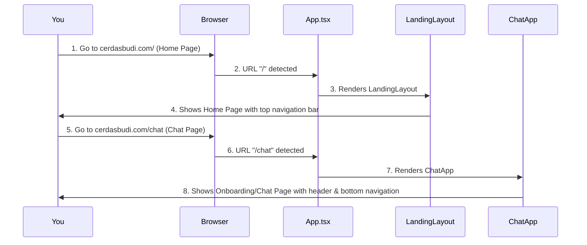
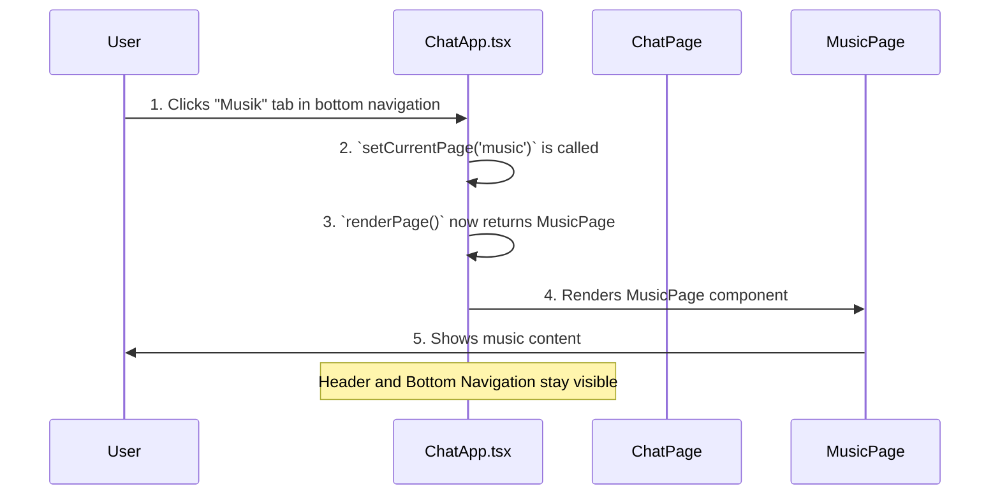

# Chapter 2: Application Routing & Layout

Welcome back! In [Chapter 1: AI Chat Interaction & Processing](01_ai_chat_interaction___processing_.md), we learned how CerdasBudi's "brain" and "mouth" work, focusing on how you talk to the AI and how it responds. We dived deep into the `ChatPage` and how messages are sent and received.

Now, let's zoom out! Imagine CerdasBudi is a big building. So far, we've only explored one important room: the chat room. But what about the other rooms, like a music lounge, a settings room, or even a welcoming lobby? How do you move between these different areas? That's where "Application Routing & Layout" comes in.

### What is Application Routing & Layout?

Think of your CerdasBudi application like a house with many rooms.

*   **Routing** is like the **GPS** or a **map** for your house. It tells the app: "If the user is at this specific web address (like `/chat` or `/info`), then show them *this* particular room or section." It guides users to different parts of the application.
*   **Layout** is like the **overall design or frame** of your house. It includes common things that stay the same no matter which room you're in, like the walls, roof, or maybe a hallway that connects all rooms. In an app, this could be a consistent header, a bottom navigation bar, or a side menu.

**The main problem it solves:** How do we organize all the different parts of CerdasBudi (like the chat screen, settings, or informational pages) and allow you to smoothly navigate between them, while keeping the app's look and feel consistent?

**Our Goal for this Chapter:** By the end of this chapter, you'll understand how CerdasBudi directs you to the right "room" or section based on the web address, and how it keeps a consistent look (layout) across different parts of the app.

### The Big Picture: Two Main Areas of CerdasBudi

CerdasBudi is designed with two major "areas" or "layouts" that help organize its features:

1.  **Landing Layout**: This is for the "public" or informational pages, like the home page, about us, or how-to-start guides. It has a classic website navigation bar at the top.
2.  **Chat App Layout**: This is for the core application features, like the AI chat itself, music playback, reminders, and user settings. It has a fixed header at the top and a convenient navigation bar at the bottom, much like a mobile app.

Let's see how CerdasBudi decides which area to show you first.

### How CerdasBudi Routes You Around (Using `react-router-dom`)

CerdasBudi uses a popular tool called `react-router-dom` to handle its routing. This tool helps connect specific web addresses (URLs) to different parts of the application.

All the magic begins in the `src/App.tsx` file. This is the very first file that runs when you open CerdasBudi.

```typescript
// src/App.tsx (simplified)
import { BrowserRouter as Router, Routes, Route } from 'react-router-dom';
import LandingLayout from './LandingLayout'; // For Home, Info, Story pages
import ChatApp from './ChatApp'; // For Chat, Music, Settings pages

function App() {
  return (
    <Router>
      <Routes>
        {/* If the web address starts with "/chat", show the ChatApp area */}
        <Route path="/chat/*" element={<ChatApp />} />

        {/* For ALL other web addresses, show the LandingLayout area */}
        <Route path="/*" element={<LandingLayout />} />
      </Routes>
    </Router>
  );
}
```

**Explanation:**
*   **`<Router>`**: This component tells the app to "listen" to changes in the web address.
*   **`<Routes>`**: This is like a big container for all the possible paths (web addresses) in your app.
*   **`<Route>`**: Each `<Route>` is a specific rule:
    *   `path="/chat/*"`: This rule says, "If the web address starts with `/chat` (like `/chat` or `/chat/settings`), then load the `ChatApp` component." The `*` means "anything else after `/chat`".
    *   `path="/*"`: This is a "catch-all" rule. It says, "For *any other* web address not caught by previous rules, load the `LandingLayout` component."

This setup ensures that when you visit `cerdasbudi.com` (which matches `/*`), you see the `LandingLayout`. But if you go to `cerdasbudi.com/chat`, you're taken straight into the `ChatApp` experience.

### Under the Hood: How Routing Works

Let's visualize how `App.tsx` acts as the main director, sending you to the correct part of the CerdasBudi building.



**Step-by-step walkthrough:**

1.  **You type a web address** into your browser.
2.  Your **Browser** tells the CerdasBudi application (specifically `App.tsx`) what address you typed.
3.  `App.tsx` looks at its `<Routes>` to find a match.
4.  If it matches `/*` (like `/` or `/info`), it tells the **LandingLayout** to appear.
5.  The **LandingLayout** then shows you the relevant informational page, always with its top navigation bar.
6.  If it matches `/chat/*`, it tells the **ChatApp** to appear.
7.  The **ChatApp** then shows you the appropriate application page (like chat, music, or settings), always with its header and bottom navigation.

### The Layouts: Organizing the "Rooms"

Now that `App.tsx` has directed you to either `LandingLayout` or `ChatApp`, let's see how these layouts organize their own "rooms" and keep a consistent look.

#### 1. The Landing Layout (`src/LandingLayout.tsx`)

This layout is for the public-facing pages. It has a common `Navigation` bar at the top and then uses `react-router-dom` again to show different pages depending on the exact address.

```typescript
// src/LandingLayout.tsx (simplified)
import { Routes, Route } from 'react-router-dom';
import Navigation from './components/Navigation'; // The top navigation bar
import HomePage from './pages/HomePage';
import InfoPage from './pages/InfoPage';
// ... other informational pages

function LandingLayout() {
  return (
    <div>
      {/* This Navigation component is always visible at the top */}
      <Navigation /> 
      <Routes>
        {/* Define which component to show for each specific landing page URL */}
        <Route path="/" element={<HomePage />} />
        <Route path="/info" element={<InfoPage />} />
        {/* More routes like /how-to-start, /story */}
      </Routes>
    </div>
  );
}
```

**Explanation:**
The `LandingLayout` always displays the `Navigation` component (your top menu). Below that, it has its own set of `<Routes>` to show different pages like `HomePage` or `InfoPage`, based on the specific path (e.g., `/` or `/info`). This means the navigation bar is always there, creating a consistent "frame" for these pages.

#### 2. The Chat App Layout (`src/ChatApp.tsx`)

This is the main application area. Unlike `LandingLayout` which uses `react-router-dom` for its internal pages, `ChatApp` manages its internal page changes using a simple internal `useState` (a React concept for remembering data). This is because its navigation is fixed at the bottom (like a mobile app tab bar) rather than relying on different web addresses for each internal page.

```typescript
// src/ChatApp.tsx (simplified)
import React, { useState } from 'react';
import ChatPage from './components/ChatPage';
import MusicPage from './components/MusicPage';
import SettingsPage from './components/SettingsPage';

function ChatApp() {
  // `currentPage` stores which tab/page is currently active (e.g., 'chat', 'music')
  const [currentPage, setCurrentPage] = useState('chat'); 

  // This function decides which page component to show based on `currentPage`
  const renderPage = () => {
    switch (currentPage) {
      case 'chat': return <ChatPage /* props */ />;
      case 'music': return <MusicPage /* props */ />;
      case 'settings': return <SettingsPage /* props */ />;
      default: return <ChatPage /* props */ />;
    }
  };

  return (
    <div className="flex flex-col min-h-screen">
      {/* Header: Always visible at the top */}
      <header> {/* CerdasBudi logo, user name, music player (if playing) */} </header>

      {/* Main content area: This is where the chosen page (Chat, Music, etc.) is shown */}
      <main className="flex-1 overflow-hidden">
        {renderPage()} {/* Shows either ChatPage, MusicPage, etc. */}
      </main>

      {/* Bottom Navigation: Always visible at the bottom */}
      <nav className="fixed bottom-0">
        {/* Buttons to switch pages, e.g., <button onClick={() => setCurrentPage('chat')}>Chat</button> */}
      </nav>
    </div>
  );
}
```

**Explanation:**
The `ChatApp` component defines a consistent "frame" for the main app experience: a fixed header at the top and a fixed navigation bar at the bottom. Inside this frame, the `renderPage()` function dynamically swaps out the main content area (showing `ChatPage`, `MusicPage`, `SettingsPage`, etc.) based on which navigation tab you click. This is a common pattern for mobile-style applications.

The specific `ChatPage` component itself (which we explored in Chapter 1) is rendered here when `currentPage` is `'chat'`.

### Internal Navigation within ChatApp

When you click on a tab (like "Chat", "Musik", "Setting") within the `ChatApp`, you're not changing the web address in your browser. Instead, `ChatApp` is just updating its internal `currentPage` state, which then tells it to show a different component.



**Step-by-step walkthrough:**

1.  **You click a tab** in the fixed bottom navigation bar (e.g., the "Musik" tab).
2.  This button tells `ChatApp.tsx` to update its `currentPage` variable to `'music'`.
3.  Because `currentPage` changed, React automatically re-runs the `ChatApp` component.
4.  Inside `ChatApp.tsx`, the `renderPage()` function now sees `currentPage` is `'music'`, so it decides to show the `MusicPage` component.
5.  The `MusicPage` component is displayed in the main content area, while the `ChatApp`'s header and bottom navigation stay exactly where they are.

This design gives CerdasBudi a very native-app feel, where you seamlessly switch between different functionalities without reloading the entire page.

### Conclusion

You've now learned how CerdasBudi organizes its many features using "Application Routing & Layout." You understand how `App.tsx` acts as the main director, using `react-router-dom` to send you to either the informational `LandingLayout` or the core `ChatApp` experience. Within `ChatApp`, you saw how a consistent header and bottom navigation frame the various features, allowing smooth internal transitions.

This structured approach makes CerdasBudi easy to navigate and ensures a consistent user experience as you move between talking to the AI, listening to music, or adjusting your settings.

Next, we'll dive into how CerdasBudi gets to know you and remembers your preferences: [User Onboarding & Settings](03_user_onboarding___settings_.md).

---

<sub><sup>Generated by [AI Codebase Knowledge Builder](https://github.com/The-Pocket/Tutorial-Codebase-Knowledge).</sup></sub> <sub><sup>**References**: [[1]](https://github.com/dandidandilll/cerdasbudi/blob/83bdae60d276e4ff7b5a2816de9d915f06e6666b/src/App.tsx), [[2]](https://github.com/dandidandilll/cerdasbudi/blob/83bdae60d276e4ff7b5a2816de9d915f06e6666b/src/ChatApp.tsx), [[3]](https://github.com/dandidandilll/cerdasbudi/blob/83bdae60d276e4ff7b5a2816de9d915f06e6666b/src/LandingLayout.tsx), [[4]](https://github.com/dandidandilll/cerdasbudi/blob/83bdae60d276e4ff7b5a2816de9d915f06e6666b/src/components/Navigation.tsx)</sup></sub>