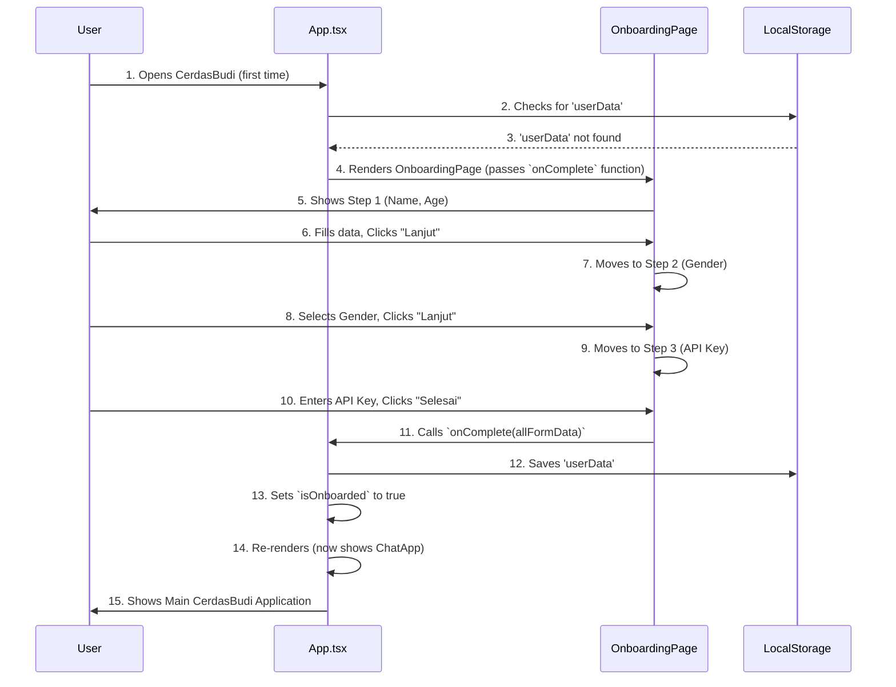
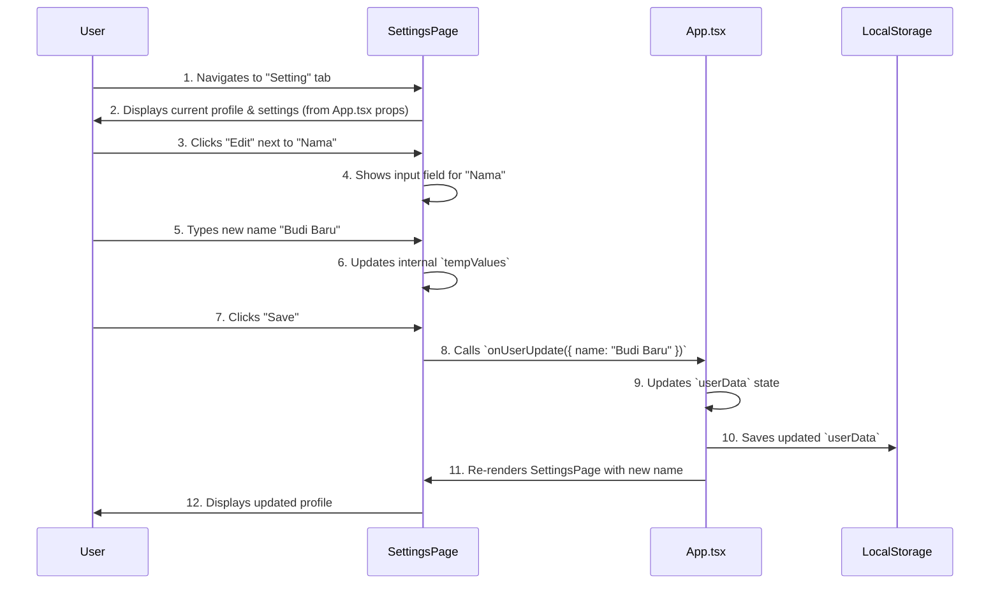

# Chapter 3: User Onboarding & Settings

Welcome back to the CerdasBudi journey! In [Chapter 2: Application Routing & Layout](02_application_routing___layout_.md), we learned how CerdasBudi organizes its different sections and helps you navigate between them, like moving through rooms in a house. We saw how the main `App.tsx` component directs you to either the informational `LandingLayout` or the core `ChatApp` experience.

Now, imagine you're visiting a new place, like a friendly clinic or a community center. Before you can use all the services, someone usually asks you a few basic questions to get to know you, right? They might ask your name, age, and what brings you here. Later, you might want to update your contact info or choose if you prefer email or text reminders.

That's exactly what "User Onboarding & Settings" is about in CerdasBudi.

### What is User Onboarding & Settings?

This part of CerdasBudi is like a **friendly registration desk** and a **personal profile manager** rolled into one.

*   **User Onboarding:** This is the initial setup process for new users. It's where CerdasBudi first gets to know you by asking for some essential information, like your name, age, and a special `API key` needed for its AI features. Think of it as your first warm welcome!
*   **Settings:** After you've set up, this is your personal space where you can review and update your details (like if your age changes!), manage app preferences (like choosing dark mode for your eyes), or even log out.

**The main problem it solves:** How do we smoothly welcome new users, gather the necessary information for a personalized AI experience, and then provide a convenient place for users to manage their profile and app preferences at any time?

**Our Goal for this Chapter:** By the end of this chapter, you'll understand how CerdasBudi guides you through the initial setup and how you can manage your personal data and app settings.

### The First Step: Onboarding a New User

When you open CerdasBudi for the very first time (or after you've logged out), the app doesn't immediately take you to the chat. Instead, it guides you through a few simple steps to get set up.

#### Why Onboarding?

CerdasBudi is an AI psychologist. To give you personalized and helpful advice, it needs to know a little bit about you. For example, knowing your name and age helps the AI tailor its responses better. Also, for the AI to work, it needs a special "key" (an API key) that connects CerdasBudi to the powerful AI brains we talked about in [Chapter 1: AI Chat Interaction & Processing](01_ai_chat_interaction___processing_.md).

The onboarding process helps CerdasBudi collect:
1.  **Nama (Name):** So CerdasBudi can address you personally.
2.  **Umur (Age):** To understand your life stage better.
3.  **Jenis Kelamin (Gender):** For more relevant psychological context.
4.  **Token AI (API Key):** The secret key that allows CerdasBudi to talk to the Groq AI brain. Without this, the chat won't work!

#### How it Works: The `OnboardingPage`

The `OnboardingPage.tsx` component is responsible for this entire welcome process.

Let's look at how the main `App.tsx` component decides whether to show the onboarding steps or the main chat application.

```typescript
// src/ChatApp.tsx (simplified)
// ... (other imports and state) ...

function App() {
  const [userData, setUserData] = useState<UserData | null>(null);
  const [isOnboarded, setIsOnboarded] = useState(false);

  useEffect(() => {
    // 1. Try to load saved user data from your device's storage
    const savedUserData = localStorage.getItem('userData');
    if (savedUserData) {
      setUserData(JSON.parse(savedUserData));
      setIsOnboarded(true); // If data found, user is onboarded!
    }
  }, []); // Run once when app starts

  const handleOnboardingComplete = (data: UserData) => {
    setUserData(data);
    localStorage.setItem('userData', JSON.stringify(data)); // Save data
    setIsOnboarded(true); // Mark as onboarded
  };

  // If user is NOT onboarded, show the OnboardingPage
  if (!isOnboarded) {
    return <OnboardingPage onComplete={handleOnboardingComplete} />;
  }

  // If user IS onboarded, show the main application layout
  return (
    <div className="...">
      {/* Header, Main Content (renderPage()), Bottom Navigation */}
      {/* ... */}
    </div>
  );
}
```
**Explanation:**
The `App` component first checks if it has saved `userData`. If it finds it, it knows you've already been "onboarded" and shows the main app. If not, it displays the `OnboardingPage`. When you finish the onboarding steps, the `OnboardingPage` calls `handleOnboardingComplete` (which was passed as a prop). This function then saves your data and updates the `isOnboarded` status, making the `App` component switch to the main chat view.

#### Filling in the Details

The `OnboardingPage` itself manages the different steps (name/age, gender, API key) and collects the information.

```typescript
// src/components/OnboardingPage.tsx (simplified)
import React, { useState } from 'react';

const OnboardingPage: React.FC<OnboardingPageProps> = ({ onComplete }) => {
  const [step, setStep] = useState(1);
  const [formData, setFormData] = useState({
    name: '', age: '', gender: '', apiKey: ''
  });

  const handleInputChange = (field: string, value: string) => {
    setFormData(prev => ({ ...prev, [field]: value }));
  };

  const handleNext = () => {
    // ... (validation logic for current step) ...
    if (step < 3) {
      setStep(step + 1); // Go to next step
    } else {
      onComplete(formData); // Call the function from App.tsx
    }
  };

  return (
    <div className="...">
      {/* Progress Bar */}
      {/* Step 1: Name & Age Input */}
      {step === 1 && (
        <div className="space-y-6">
          {/* Input fields for name and age */}
          <input type="text" onChange={(e) => handleInputChange('name', e.target.value)} />
          <input type="number" onChange={(e) => handleInputChange('age', e.target.value)} />
        </div>
      )}
      {/* Step 2: Gender Selection */}
      {step === 2 && (
        <div className="space-y-6">
          {/* Buttons for gender selection */}
          <button onClick={() => handleInputChange('gender', 'Laki-laki')}>Laki-laki</button>
          <button onClick={() => handleInputChange('gender', 'Perempuan')}>Perempuan</button>
        </div>
      )}
      {/* Step 3: API Key Input */}
      {step === 3 && (
        <div className="space-y-6">
          {/* Input field for API Key and 'Get Demo Token' button */}
          <input type="password" onChange={(e) => handleInputChange('apiKey', e.target.value)} />
          <button onClick={handleGetDemoToken}>Dapatkan Token Demo Gratis</button>
        </div>
      )}
      <div className="flex justify-between mt-8">
        <button onClick={handleBack}>Kembali</button>
        <button onClick={handleNext}>
          {step === 3 ? 'Selesai' : 'Lanjut'}
        </button>
      </div>
    </div>
  );
};
```
**Explanation:**
The `OnboardingPage` uses a `step` variable to decide which part of the form to show. When you type or select an option, it updates the `formData`. When you click "Lanjut" (Next), it checks if the current step's information is valid. If it's the last step and everything is valid, it calls the `onComplete` function (from `App.tsx`) to send all the collected data back.



### Managing Your Profile & Settings

Once you're onboarded, you can always visit the "Setting" tab (which you learned about in [Chapter 2: Application Routing & Layout](02_application_routing___layout_.md) is managed by `ChatApp.tsx`) to update your information or change app preferences.

#### What Can You Manage?

The Settings page allows you to:
*   **Informasi Pribadi (Personal Information):** Change your name, age, or gender.
*   **Token Management:** Update your API key if it changes or if you get a new one.
*   **Pengaturan Aplikasi (App Settings):** Toggle notifications or switch between light and dark mode.
*   **Tentang CerdasBudi (About):** Learn more about the app's mission and privacy.
*   **Keluar (Logout):** Clear all your saved data and return to the onboarding screen.

#### How it Works: The `SettingsPage`

The `SettingsPage.tsx` component is where all this management happens.

```typescript
// src/ChatApp.tsx (simplified)
// ... (other imports and state) ...

function App() {
  // ... (userData, settings, chatMessages states) ...

  const handleUserDataUpdate = (newData: Partial<UserData>) => {
    if (userData) {
      const updatedData = { ...userData, ...newData };
      setUserData(updatedData);
      localStorage.setItem('userData', JSON.stringify(updatedData)); // Save update
    }
  };

  const handleSettingsUpdate = (newSettings: Partial<AppSettings>) => {
    const updatedSettings = { ...settings, ...newSettings };
    setSettings(updatedSettings);
    localStorage.setItem('appSettings', JSON.stringify(updatedSettings)); // Save update
  };

  const handleLogout = () => {
    localStorage.removeItem('userData');
    localStorage.removeItem('appSettings');
    localStorage.removeItem('chatMessages');
    localStorage.removeItem('musicState');
    setUserData(null);
    setIsOnboarded(false); // Go back to onboarding
    setChatMessages([]);
    setSettings({ darkMode: false, notifications: true });
    // Reset music state as well
  };

  const renderPage = () => {
    switch (currentPage) {
      // ... other cases ...
      case 'settings':
        return (
          <SettingsPage 
            userData={userData!} 
            settings={settings}
            onUserUpdate={handleUserDataUpdate} // How SettingsPage updates user data
            onSettingsUpdate={handleSettingsUpdate} // How SettingsPage updates app settings
            onLogout={handleLogout} // How SettingsPage triggers logout
          />
        );
      // ...
    }
  };
  // ...
}
```
**Explanation:**
The `App` component manages the `userData` and `settings` centrally. When it renders the `SettingsPage`, it passes these data and special functions (`onUserUpdate`, `onSettingsUpdate`, `onLogout`) as props. This allows the `SettingsPage` to request changes, and `App.tsx` handles saving those changes to `localStorage` and updating its own state.

#### Editing Your Details

Inside `SettingsPage.tsx`, each editable field (like Name, Age, API Key) has a dedicated section.

```typescript
// src/components/SettingsPage.tsx (simplified)
import React, { useState } from 'react';

const SettingsPage: React.FC<SettingsPageProps> = ({ 
  userData, settings, onUserUpdate, onSettingsUpdate, onLogout 
}) => {
  const [editingField, setEditingField] = useState<string | null>(null);
  const [tempValues, setTempValues] = useState<Partial<UserData>>({});

  const handleEdit = (field: string, currentValue: string) => {
    setEditingField(field);
    setTempValues({ [field]: currentValue }); // Set current value to temp
  };

  const handleSave = (field: string) => {
    const newValue = tempValues[field as keyof UserData];
    if (newValue) {
      onUserUpdate({ [field]: newValue }); // Call App.tsx to update user data
    }
    setEditingField(null); // Exit editing mode
    setTempValues({}); // Clear temp values
  };

  const handleSettingToggle = (setting: keyof AppSettings) => {
    onSettingsUpdate({ [setting]: !settings[setting] }); // Call App.tsx to update setting
  };

  return (
    <div className="...">
      {/* Profile Header */}
      {/* Personal Information Section */}
      <div>
        {/* Name Field */}
        <div>
          {editingField === 'name' ? (
            <div className="flex items-center">
              <input value={tempValues.name || ''} onChange={(e) => setTempValues({ ...tempValues, name: e.target.value })} />
              <button onClick={() => handleSave('name')}>Save</button>
              <button onClick={() => setEditingField(null)}>Cancel</button>
            </div>
          ) : (
            <div className="flex items-center">
              <span>{userData.name}</span>
              <button onClick={() => handleEdit('name', userData.name)}>Edit</button>
            </div>
          )}
        </div>
        {/* ... similar for Age, Gender, API Key ... */}
      </div>

      {/* App Settings Section (Dark Mode, Notifications) */}
      <div className="flex items-center justify-between">
        <span>Mode Gelap</span>
        <button onClick={() => handleSettingToggle('darkMode')}>Toggle</button>
      </div>

      {/* Logout Button */}
      <button onClick={onLogout}>Keluar</button>
    </div>
  );
};
```
**Explanation:**
For each piece of user data, `SettingsPage` uses `editingField` state to know if it's currently being edited. When you click "Edit", it sets `editingField` and copies the current value to `tempValues`. You can then type in the input box, updating `tempValues`. When you click "Save", it uses the `onUserUpdate` prop to send the new value back to `App.tsx` to be saved. For app settings like dark mode, it directly uses `onSettingsUpdate` to toggle the value.



### Data Persistence: Remembering You

Both onboarding data and settings are saved using `localStorage`. This is a simple way for web applications to store small bits of information right in your browser. This means CerdasBudi will remember who you are and your preferences even if you close the tab or shut down your computer and come back later!

In `src/ChatApp.tsx`, `useEffect` hooks are used to automatically save data whenever they change:

```typescript
// src/ChatApp.tsx (simplified)

useEffect(() => {
  // Save user data whenever it changes
  if (userData) { // Only save if data exists
    localStorage.setItem('userData', JSON.stringify(userData));
  }
}, [userData]); // This effect runs when `userData` changes

useEffect(() => {
  // Save app settings whenever they change
  localStorage.setItem('appSettings', JSON.stringify(settings));
}, [settings]); // This effect runs when `settings` changes

// ... similar for chatMessages and musicState ...
```
**Explanation:**
These `useEffect` blocks are like little assistants constantly watching over your `userData` and `settings`. As soon as they notice a change, they immediately update the saved information in your browser's `localStorage`. This is how CerdasBudi "remembers" you and your choices between sessions.

### Conclusion

You've now explored how CerdasBudi welcomes new users and provides a comprehensive settings area. You learned about the multi-step onboarding process, how `App.tsx` orchestrates showing either the onboarding or the main app, and how `SettingsPage` allows you to manage your personal details, AI key, and app preferences like dark mode. The magic of `localStorage` ensures your choices are remembered.

This system ensures that CerdasBudi is both personalized and easy to manage, giving you control over your experience.

Next, we'll dive into another exciting feature: [Global Music Playback System](04_global_music_playback_system_.md).

---

<sub><sup>Generated by [AI Codebase Knowledge Builder](https://github.com/The-Pocket/Tutorial-Codebase-Knowledge).</sup></sub> <sub><sup>**References**: [[1]](https://github.com/dandidandilll/cerdasbudi/blob/83bdae60d276e4ff7b5a2816de9d915f06e6666b/src/ChatApp.tsx), [[2]](https://github.com/dandidandilll/cerdasbudi/blob/83bdae60d276e4ff7b5a2816de9d915f06e6666b/src/components/OnboardingPage.tsx), [[3]](https://github.com/dandidandilll/cerdasbudi/blob/83bdae60d276e4ff7b5a2816de9d915f06e6666b/src/components/SettingsPage.tsx)</sup></sub>