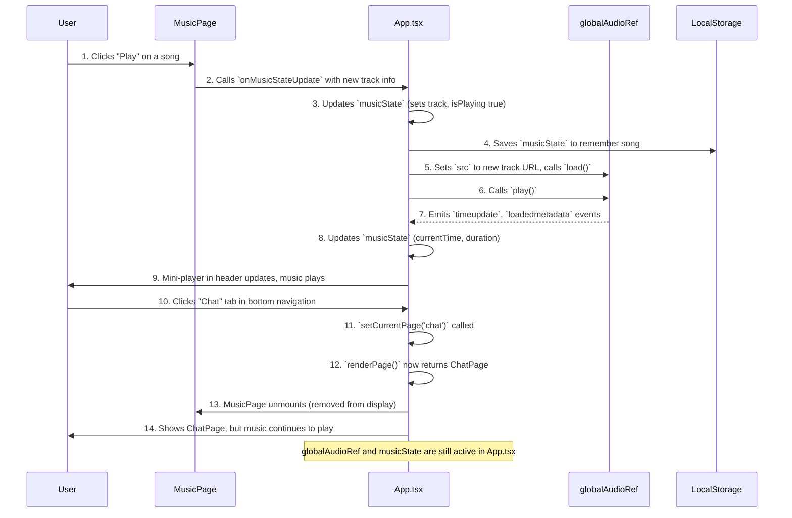

# Chapter 4: Global Music Playback System

Welcome back, future CerdasBudi expert! In [Chapter 3: User Onboarding & Settings](03_user_onboarding___settings_.md), we learned how CerdasBudi gets to know you through the onboarding process and how you can manage your personal profile and app preferences. We saw how your data and settings are remembered using `localStorage`.

Now, let's talk about something that can really enhance your experience with CerdasBudi: music! Imagine you're chatting with the AI, feeling a bit stressed, and you decide you want some calming background music. You go to the music section, pick a song, and then *seamlessly* switch back to your chat with CerdasBudi, *without the music ever stopping*. That's the magic of the "Global Music Playback System."

### What is a Global Music Playback System?

Think of CerdasBudi like a house, and the music system is like a **central sound system** that plays music throughout the entire house. No matter which room you walk into (the chat room, the settings room, or the reminder room), the music keeps playing from the same speaker.

**The main problem it solves:** How do we make sure music keeps playing continuously in the background, even when you move to different parts or "pages" of the CerdasBudi app? And how do we control that music (play, pause, change volume) from anywhere?

**Our Goal for this Chapter:** By the end of this chapter, you'll understand how CerdasBudi creates this "universal background music player" experience, allowing you to enjoy your chosen tunes regardless of which section of the app you're using.

### The Problem: Music Stopping

If we didn't have a global music system, what would happen?
1.  You go to the `MusicPage` and play a song.
2.  The song starts playing.
3.  You click the "Chat" tab to go back to the `ChatPage`.
4.  **Problem!** The `MusicPage` might "unload" or "disappear" when you leave it, causing the music to stop. This would be annoying!

Our "Global Music Playback System" solves this by having one single "music brain" that lives above all the pages.

### Key Concepts: How it Works

To make music play everywhere, CerdasBudi uses a few clever ideas:

1.  **A Single Music Brain (`musicState` in `App.tsx`):** Instead of each page (like `MusicPage`) trying to play music on its own, there's one central place (`App.tsx`) that knows everything about the music:
    *   `currentTrack`: Which song is playing right now?
    *   `isPlaying`: Is it currently playing or paused?
    *   `currentTime`: How far into the song are we?
    *   `volume`: How loud is it?

    This `musicState` is like the central control panel for our house's sound system.

2.  **A Global Speaker (`globalAudioRef` in `App.tsx`):** We use a special "reference" (`useRef`) to an actual HTML audio player. This single `HTMLAudioElement` is created once when the app starts and is used for *all* music playback. It's like having one main speaker that never turns off.

3.  **Cross-Page Control:** Because the `musicState` and `globalAudioRef` live in `App.tsx` (the main "frame" of our application, remember [Chapter 2: Application Routing & Layout](02_application_routing___layout_.md)?), they are always active.
    *   The `MusicPage` can tell the central `App.tsx` to change the `musicState` (e.g., "play this song").
    *   The `App.tsx` then tells its `globalAudioRef` (the speaker) to actually play the music.
    *   Anywhere in the app, the `App.tsx` can display a small mini-player in its header, showing what's playing and giving you quick play/pause access.

4.  **Remembering the Music (`localStorage`):** Just like your user data and settings, the `musicState` is also saved to your device's `localStorage`. So, if you close CerdasBudi and open it later, the app remembers which song was playing and where you left off!

### How to Use It: Playing Music Globally

Let's walk through the main use case: playing a song from the Music page and having it continue when you switch to Chat.

#### 1. The Music Page (`src/components/MusicPage.tsx`)

This is where you browse and pick your songs. When you click a "Play" button next to a song, it doesn't directly play the music. Instead, it tells the main `App.tsx` component what to play.

Here's how `MusicPage` tells `App.tsx` to play a track:

```typescript
// src/components/MusicPage.tsx (simplified)

interface MusicPageProps {
  musicState: MusicState; // Current music info
  onMusicStateUpdate: (state: MusicState) => void; // Function to update music info
  // ... other props
}

const MusicPage: React.FC<MusicPageProps> = ({ musicState, onMusicStateUpdate }) => {
  // ... (moods and tracks data) ...

  const playTrack = (track: Track) => {
    // Tell the App component to update the music state
    // Set the new track, set playing to true, reset time to 0
    onMusicStateUpdate({
      ...musicState, // Keep existing state if not changing
      currentTrack: track,
      isPlaying: true,
      currentTime: 0
    });
  };

  // ... (JSX for displaying tracks and play buttons) ...
  // When a play button is clicked:
  // <button onClick={() => playTrack(track)}> <Play /> </button>
};
```

**Explanation:**
The `MusicPage` receives a special function called `onMusicStateUpdate` from `App.tsx`. When you click a song, `playTrack` is called, and it uses `onMusicStateUpdate` to send all the new music information (which song, that it should be playing) back up to `App.tsx`.

#### 2. The Global Playback Controller (`src/ChatApp.tsx`)

This is where the real work happens. `App.tsx` receives the `musicState` updates from `MusicPage` and uses its `globalAudioRef` (the "speaker") to control the actual audio.

```typescript
// src/ChatApp.tsx (simplified)

function App() {
  const [musicState, setMusicState] = useState<MusicState>({ /* ... initial state ... */ });
  const globalAudioRef = useRef<HTMLAudioElement | null>(null); // Our global speaker

  // 1. Initialize the audio player when the app starts
  useEffect(() => {
    if (!globalAudioRef.current) {
      globalAudioRef.current = new Audio(); // Create the actual audio element
    }
    const audio = globalAudioRef.current;
    // ... setup event listeners (like 'timeupdate', 'ended') to update musicState ...
    // This allows the player to tell us when the song progresses or ends.
  }, []); // Runs only once

  // 2. Respond to changes in musicState (play, pause, change song)
  useEffect(() => {
    const audio = globalAudioRef.current;
    if (!audio) return;

    if (musicState.currentTrack) {
      // If a new track is selected, load its URL
      if (audio.src !== musicState.currentTrack.url) {
        audio.src = musicState.currentTrack.url;
        audio.load();
      }
      // Set the volume
      audio.volume = musicState.volume;
      // Play or pause based on isPlaying
      if (musicState.isPlaying) {
        audio.play().catch(e => console.error("Error playing audio:", e));
      } else {
        audio.pause();
      }
    } else {
      audio.pause(); // If no track, stop playing
    }
  }, [musicState.currentTrack, musicState.isPlaying, musicState.volume]);

  // ... (passing musicState and setMusicState to MusicPage) ...
}
```

**Explanation:**
The `App` component has two important `useEffect` blocks:
1.  The first one sets up our `globalAudioRef` (the speaker) when the app first loads. It also attaches "listeners" to it, so when the speaker's time changes (song plays), or it finishes, it tells `App.tsx` to update its `musicState`.
2.  The second `useEffect` acts as the "controller." Whenever `musicState.currentTrack` (which song), `musicState.isPlaying` (play/pause), or `musicState.volume` changes, this code runs. It checks if there's a new song, loads it into the speaker, sets the volume, and then tells the speaker to either play or pause.

#### 3. The Mini-Player in the Header (`src/ChatApp.tsx`)

Remember the `ChatApp`'s fixed header from [Chapter 2: Application Routing & Layout](02_application_routing___layout_.md)? We use that space to show a small music player when a song is active.

```typescript
// src/ChatApp.tsx (simplified)

function App() {
  // ... (musicState, currentPage, etc.) ...

  return (
    <div className="...">
      {/* Fixed Header */}
      <header className="...">
        {/* Main Header Row (logo, user info) */}
        {/* ... */}

        {/* Music Player Row - Only show when music is playing */}
        {musicState.currentTrack && ( // If there's a current track, show this!
          <div className="px-3 pb-2">
            <div className="bg-purple-50 dark:bg-purple-900/20 rounded-lg p-2">
              <div className="flex items-center space-x-2">
                {/* Music Info: title, artist, animated playing bars */}
                <button
                  onClick={() => setCurrentPage('music')} // Click to go to MusicPage
                  className="flex items-center space-x-2 flex-1 min-w-0 ..."
                >
                  
                  <div className="flex-1 min-w-0">
                    <p className="text-xs font-medium ... truncate">{musicState.currentTrack.title}</p>
                    <p className="text-xs text-gray-500 ... truncate">{musicState.currentTrack.artist}</p>
                  </div>
                  {musicState.isPlaying && ( /* Show pulsating bars when playing */
                    <div className="flex space-x-0.5 ...">
                      <div className="w-0.5 h-2 bg-purple-600 animate-pulse"></div>
                      {/* ... more bars ... */}
                    </div>
                  )}
                </button>
                
                {/* Play/Pause Button */}
                <button
                  onClick={(e) => {
                    e.stopPropagation();
                    setMusicState(prev => ({ ...prev, isPlaying: !prev.isPlaying })); // Toggle play/pause
                  }}
                  className="p-2 rounded-full bg-purple-100 ..."
                >
                  {musicState.isPlaying ? (<Pause />) : (<Play />)}
                </button>
              </div>
            </div>
          </div>
        )}
      </header>

      {/* Main Content (where ChatPage, MusicPage etc. are rendered) */}
      <main className="flex-1 overflow-hidden ...">
        {renderPage()}
      </main>

      {/* Fixed Bottom Navigation */}
      {/* ... */}
    </div>
  );
}
```

**Explanation:**
The header actively checks `musicState.currentTrack`. If a song is selected, it displays a compact player with the song's title, artist, and a play/pause button. Crucially, the play/pause button directly updates `musicState.isPlaying` in `App.tsx`, which then tells the `globalAudioRef` (the speaker) to play or pause, demonstrating how control is truly global. Clicking on the music info itself takes you directly to the `MusicPage`.

### Under the Hood: The Global Music Flow

Let's visualize the entire process when you start playing music and then switch pages.



**Step-by-step walkthrough:**

1.  **You click "Play"** on a song within the `MusicPage`.
2.  The `MusicPage` doesn't play the music itself; it tells the central `App.tsx` component to update the `musicState` with the details of the song you want to play.
3.  `App.tsx` updates its internal `musicState` with the new song and sets `isPlaying` to true.
4.  `App.tsx` immediately saves this updated `musicState` to `localStorage` so it remembers your progress even if you close the app.
5.  Because `musicState` changed, a special `useEffect` inside `App.tsx` (our "controller") takes action: it tells the `globalAudioRef` (our "speaker") to load the new song's audio file (`src`) and start playing it (`play()`).
6.  The `globalAudioRef` (speaker) starts playing the music and also sends updates back to `App.tsx` (like its current position in the song).
7.  `App.tsx` receives these updates and refreshes its `musicState` with the current time and duration.
8.  As a result, the small **mini-player in the header of `App.tsx`** updates to show the correct song and its progress, and **you hear the music!**

---

9.  Now, **you click the "Chat" tab** in the bottom navigation.
10. `App.tsx` changes which page it's showing from `MusicPage` to `ChatPage` (as learned in [Chapter 2: Application Routing & Layout](02_application_routing___layout_.md)).
11. The `MusicPage` component is no longer displayed.
12. **Crucially, the `globalAudioRef` (speaker) and the `musicState` are still actively managed by `App.tsx`!** They were never removed from the "house."
13. `App.tsx` now shows the `ChatPage`, but because the speaker is still playing in the background (controlled by `App.tsx`), the **music continues to play seamlessly!**

This robust system ensures that your music enjoyment isn't interrupted as you navigate CerdasBudi.

### Conclusion

You've now uncovered the secret behind CerdasBudi's seamless background music! You learned how a central `musicState` in `App.tsx` acts as the "music brain," controlling a single `globalAudioRef` (the "speaker") that plays music throughout the entire application. This setup, along with the handy mini-player in the header, ensures that your chosen tunes keep playing, no matter which part of CerdasBudi you're exploring.

Next up, we'll dive into how CerdasBudi changes its look and feel: [Theming (Dark Mode)](05_theming__dark_mode__.md).

---

<sub><sup>Generated by [AI Codebase Knowledge Builder](https://github.com/The-Pocket/Tutorial-Codebase-Knowledge).</sup></sub> <sub><sup>**References**: [[1]](https://github.com/dandidandilll/cerdasbudi/blob/83bdae60d276e4ff7b5a2816de9d915f06e6666b/src/ChatApp.tsx), [[2]](https://github.com/dandidandilll/cerdasbudi/blob/83bdae60d276e4ff7b5a2816de9d915f06e6666b/src/components/MusicPage.tsx)</sup></sub>