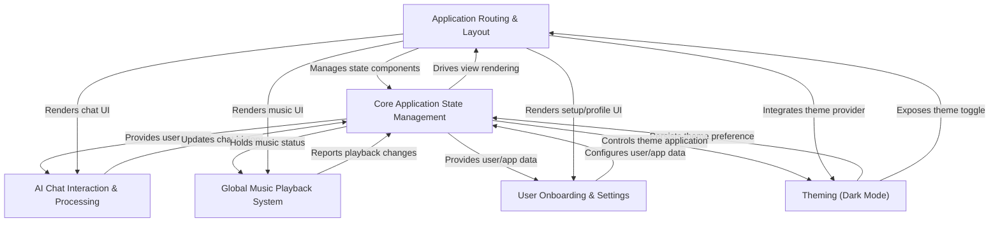

# Tutorial: cerdasbudi

CerdasBudi is a **mental health support chatbot** designed to provide empathetic AI conversations and practical advice for users. It features a *personalized chat experience* with an AI assistant, including voice interaction, and a *global music player* to help manage moods. The application also includes an *easy onboarding process* to collect user information and allows users to *customize their experience* through various settings, such as switching to dark mode.

## Visual Overview

## Chapters

1. [AI Chat Interaction & Processing
](01_ai_chat_interaction___processing_.md)
2. [Application Routing & Layout
](02_application_routing___layout_.md)
3. [User Onboarding & Settings
](03_user_onboarding___settings_.md)
4. [Global Music Playback System
](04_global_music_playback_system_.md)
5. [Theming (Dark Mode)
](05_theming__dark_mode__.md)
6. [Core Application State Management
](06_core_application_state_management_.md)
7. [Getting Started
](07_getting_started_.md)

---

Generated by [AI Codebase Knowledge Builder](https://github.com/The-Pocket/Tutorial-Codebase-Knowledge).
